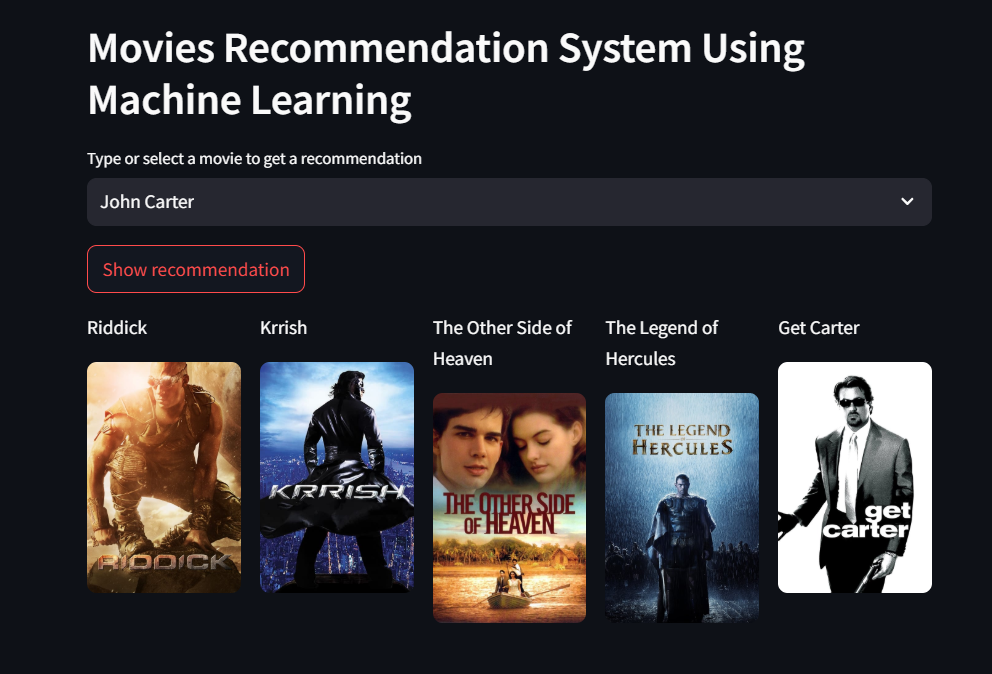

# 🎬 Movie Recommendation System



Welcome to the **Movie Recommendation System**, a Streamlit-powered web application that helps users discover new movies based on their preferences. 🚀

---

## 🖼️ Preview


_A sneak peek of the application interface._

---

## ✨ Features

✅ Get personalized movie recommendations instantly  
✅ Uses **vectorization models** for similarity scoring  
✅ Clean and simple **Streamlit UI**  
✅ Based on a **processed dataset** for accurate suggestions

---

## 📂 Project Structure

```
📁 movie-recommendation-system
│── app.py              # Streamlit application file
│── dataset.pkl         # Processed movie dataset
│── vectorizer.pkl      # Pre-trained vectorizer model
│── main_page.png       # Screenshot of the app
│── README.md           # Project documentation
```

---

## 🚀 How to Use

1. Open the deployed **[Streamlit App](https://your-app-url)** (Replace with your actual link)
2. Enter a **movie name**
3. Get instant **recommendations**

---

## ⚙️ Installation (For Local Setup)

If you want to run this locally, install Streamlit first:

```bash
pip install streamlit
```

Then, start the app:

```bash
streamlit run app.py
```

---

## 🔮 Future Improvements

📌 Add **IMDb ratings & posters** to recommendations  
📌 Improve **recommendation algorithm** for better accuracy  
📌 Allow **user ratings** to refine suggestions

---

## 💬 Contact & Contributions

Feel free to contribute to the project or report any issues!  
📩 Your Email / GitHub Link

Happy Coding! 🎥🍿
